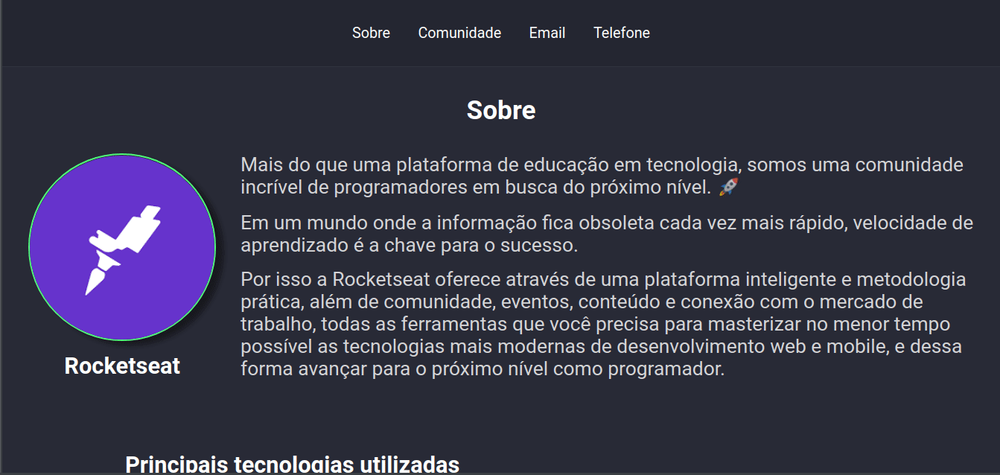

<h1 align="center">
    
</h1>

<h3 align="center">
  Desafio 2-2: Página de descrição
</h3>

<blockquote align="center">“Quanto mais você estuda, mais aprende e se aproxima de realizar seu sonhos!”</blockquote>

  

  

  <a href="#rocket-sobre-o-desafio">Sobre o desafio</a>&nbsp;&nbsp;&nbsp;|&nbsp;&nbsp;&nbsp;
  <a href="#calendar-entrega">Entrega</a>&nbsp;&nbsp;&nbsp;|&nbsp;&nbsp;&nbsp;
  <a href="#memo-licença">Licença</a>

---

## 👨‍💻 Resultado do desafio

## :rocket: Sobre o desafio

A partir do arquivo do desafio 2-1, adicionar um novo link no header chamado Sobre. Essa página deverá mostrar informações referentes a Rocketseat.

### Informações da página

- Uma imagem da logo da empresa
- O nome da empresa
- Uma breve descrição da empresa
- Uma lista com as principais tecnologias utilizadas. Dica: utilize a tag `ul` para lista e `li` para o item da lista.
- Links para as redes sociais da empresa (Github, Instagram e Facebook)

### Estilização

Você tem liberdade para escolher a estilização que preferir para esse desafio, mas alguns pontos são obrigatórios:

- A imagem deve ter uma borda e um formato circular.
- Deve ser utilizada a fonte Roboto
- O nome da empresa e a imagem devem ser destacar do restante
- Os links das redes sociais devem ter alguma alteração visual quando o cursor do mouse passar por cima

## :memo: Licença

Esse projeto está sob a licença MIT. Veja o arquivo [LICENSE](../LICENSE) para mais detalhes.

---

#### Desenvolvido com 💙️ por:

***Jean Monteiro*** 
  
