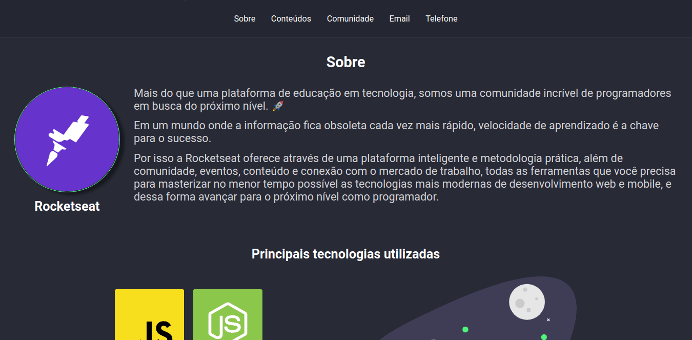

<h1 align="center">
    
</h1>

<h3 align="center">
  Desafio 3-3: Página de descrição do conteúdo
</h3>

<blockquote align="center">“Não se perca tentando ser melhor que ninguém, esforce-se apenas por ser e dar o melhor de você.”</blockquote>

<p align="center">

  <a href="https://github.com/jeanmontt">
    
  </a>

  <a href="https://github.com/jeanmontt/launchbase/commits/master" >
    
  </a>

</p>

<p align="center">
  <a href="#rocket-sobre-o-desafio">Sobre o desafio</a>&nbsp;&nbsp;&nbsp;|&nbsp;&nbsp;&nbsp;
  <a href="#calendar-entrega">Entrega</a>&nbsp;&nbsp;&nbsp;|&nbsp;&nbsp;&nbsp;
  <a href="#memo-licença">Licença</a>
</p>

---

## 👨‍💻 Resultado do desafio



---

## :rocket: Sobre o desafio

Nesse desafio você deve criar uma página de descrição do conteúdo que deve ser chamada no lugar da modal quando o usuário clicar no card do conteúdo.

### Rota

A rota também será a `/content`, porém o id do curso será passado via route params (ex.: `/content/id_do_conteudo`). Dica: utilize o req.params para recuperar o id fornecido na rota.

```js
server.get("/content/:id", function(req, res) {
  const id = req.params.id;

  return res.send(`O id fornecido na rota é: ${id}`);
});
```

### Informações

- Layout padrão
- Card do conteúdo
- Link que redireciona para a página do conteúdo

### Fórum

Se houver mais dúvida sobre o desafio, essa thread no fórum poderá ser útil para você 💜 
https://skylab.rocketseat.com.br/h/forum/launchbase/07c66e6d-06ff-4cfb-baf2-b5b27be6ac8b

### Estilização

Você tem liberdade para escolher a estilização que preferir para esse desafio.

## 💾️ Como baixar/testar o projeto

- Você irá precisar instalar o [Git](https://git-scm.com/), [NodeJS](https://nodejs.org/pt-br/download/) + [npm](https://www.npmjs.com/get-npm):

```bash
# Versões mínimas ou superiores.
$ node -v
v12.18.3

$ npm -v
6.14.6
```

- Para configurar, no bash digite os seguinte códigos:

```bash
# Clonar o repositório
$ git clone https://github.com/jeanmontt/launchbase.git

#Entrar no diretório
$ cd launchbase/fase_02/03_inciando_back_end/desafio_03-3_pagina-descricao-conteudo

#Instalar as dependências
$ npm install

#Iniciar o local host
$ npm start
```

- Por ultimo abra seu navegador e digite:

```
localhost:3000
```

## :memo: Licença

Esse projeto está sob a licença MIT. Veja o arquivo [LICENSE](../LICENSE) para mais detalhes.

---

#### Desenvolvido com 💙️ por:

***Jean Monteiro*** 
<br/> 
<a href="https://www.linkedin.com/in/jeanmont/">

</a>