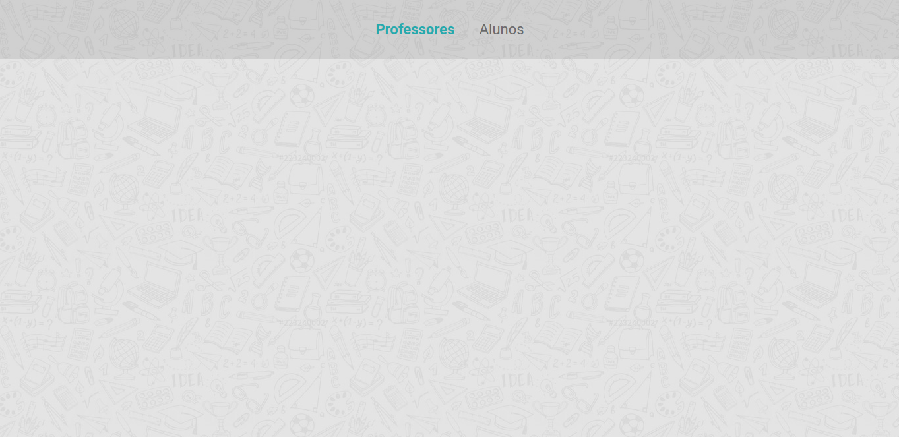

<h1 align="center">
    
</h1>

<h3 align="center">
  Desafio 4-1: Header
</h3>

<blockquote align="center">“Transportai um punhado de terra todos os dias e fareis uma montanha.”</blockquote>

  

  

  <a href="#rocket-sobre-o-desafio">Sobre o desafio</a>&nbsp;&nbsp;&nbsp;|&nbsp;&nbsp;&nbsp;
  <a href="#calendar-entrega">Entrega</a>&nbsp;&nbsp;&nbsp;|&nbsp;&nbsp;&nbsp;
  <a href="#memo-licença">Licença</a>

## 👨‍💻 Resultado do desafio

---

## :rocket: Sobre o desafio

Esse é o primeiro desafio da sequência de criação de um site de aulas particulares. A ideia é que você aplique, em pequenas doses, os conhecimentos aprendidos nas aulas. Nessa primeira etapa, você deve criar um header com dois links: `Teachers` e `Students` (aproveite a estrutura criada no módulo 03)

### Estilização

Você tem liberdade para escolher a estilização que preferir para esse desafio, mas alguns pontos são obrigatórios:

- Deve ser aplicado um background;
- Deve ser utilizada a fonte Roboto;
- Utilize o conceito de `box-sizing` e o seletor `+` para centralizar os seus links;
- Utilize o `after` e o `transition` para aplicar um efeito visual nos links quando o mouse passar por cima.

## :calendar: Entrega

Esse desafio **não precisa ser entregue** e não receberá correção. Após concluí-lo, adicionar esse código ao seu Github é uma boa forma de demonstrar seus conhecimentos para oportunidades futuras.

## :memo: Licença

Esse projeto está sob a licença MIT. Veja o arquivo [LICENSE](../LICENSE) para mais detalhes.

---

Feito com :purple_heart: by [Rocketseat](https://rocketseat.com.br) :wave: [Entre na nossa comunidade!](https://discordapp.com/invite/gCRAFhc)