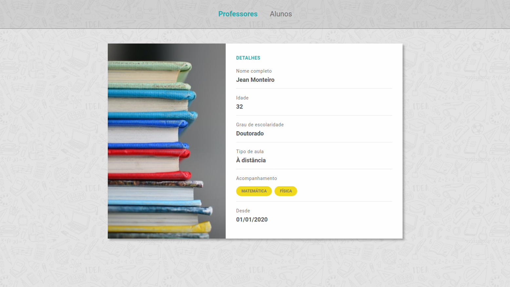

<h1 align="center">
    
</h1>

<h3 align="center">
  Desafio 4-2: Card do Professor
</h3>

<blockquote align="center">“Sua única limitação é você mesmo!”</blockquote>

<p align="center">

  <a href="https://github.com/jeanmontt">
    
  </a>

  <a href="https://github.com/jeanmontt/launchbase/commits/master" >
    
  </a>

</p>

<p align="center">
  <a href="#rocket-sobre-o-desafio">Sobre o desafio</a>&nbsp;&nbsp;&nbsp;|&nbsp;&nbsp;&nbsp;
  <a href="#calendar-entrega">Entrega</a>&nbsp;&nbsp;&nbsp;|&nbsp;&nbsp;&nbsp;
  <a href="#memo-licença">Licença</a>
</p>

## 👨‍💻 Resultado do desafio



## :rocket: Sobre o desafio

Nessa etapa você deve utilizar o browser-sync e criar um card para apresentação das informações do professor.

### Browser-sync

Utilize as libs `browser-sync` e `npm-run-all` e rode os processos da sua aplicação e do `browser-sync` em paralelo.

### Card

Esse componente deve ser dividido em duas seções: imagem e detalhes. As seguintes informações são obrigatórias:

- Imagem randômica de uma coleção de professores (utilize a api do unsplash);
- Nome completo;
- Idade;
- Grau de escolaridade (ex.: Doutorado);
- Tipo de aula (presencial ou à distância);
- Acompanhamento (ex.: Matemática e Física);
- Desde (data de cadastro na plataforma).

### Estilização

Você tem liberdade para escolher a estilização que preferir para esse desafio, mas alguns pontos são obrigatórios:

- A imagem deve ocupar 40% do card e os detalhes 60%.
- Utilize o seletor `first-child` e `border-top` para estilizar as divisórias entre os items.
- Utilize o seletor `nth-child()` para estilizar o label (ex.: Desde) e valor (ex.: 02/02/2020) do item.
- Utilize o `keyframes` e o `animation` para fazer uma animação do card.
- Utilize o `box-shadow` para aplicar uma sombra no card.

## 💾️ Como baixar/testar o projeto

- Você irá precisar instalar o [Git](https://git-scm.com/), [NodeJS](https://nodejs.org/pt-br/download/) + [npm](https://www.npmjs.com/get-npm):

```bash
# Versões mínimas ou superiores.
$ node -v
v12.18.3

$ npm -v
6.14.6
```

- Para configurar, no bash digite os seguinte códigos:

```bash
# Clonar o repositório
$ git clone https://github.com/jeanmontt/launchbase.git

#Entrar no diretório
$ cd launchbase/fase_03/01_controle_de_academia/desafio_4-2_card_do_professor

#Instalar as dependências
$ npm install

#Iniciar o local host
$ npm start
```

- Por ultimo abra seu navegador e digite:

```
localhost:3000
```

## :memo: Licença

Esse projeto está sob a licença MIT. Veja o arquivo [LICENSE](../LICENSE) para mais detalhes.

---

#### Desenvolvido com 💙️ por:

***Jean Monteiro*** 
<br/> 
<a href="https://www.linkedin.com/in/jeanmont/">

</a>