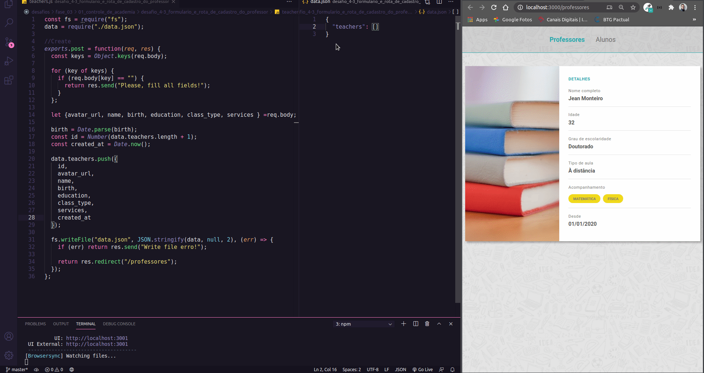

<h1 align="center">
    
</h1>

<h3 align="center">
  Desafio 4-3: Formulário e Rota de cadastro do Professor
</h3>

<blockquote align="center">“Tudo deveria se tornar o mais simples possível, mas não simplificado.”</blockquote>

<p align="center">

  <a href="https://github.com/jeanmontt">
    
  </a>

  <a href="https://github.com/jeanmontt/launchbase/commits/master" >
    
  </a>

</p>

<p align="center">
  <a href="#rocket-sobre-o-desafio">Sobre o desafio</a>&nbsp;&nbsp;&nbsp;|&nbsp;&nbsp;&nbsp;
  <a href="#calendar-entrega">Entrega</a>&nbsp;&nbsp;&nbsp;|&nbsp;&nbsp;&nbsp;
  <a href="#memo-licença">Licença</a>
</p>

## 👨‍💻 Resultado do desafio



## :rocket: Sobre o desafio

Nessa etapa você deve criar um formulário de cadastro do professor e uma rota do tipo `post` que irá realizar as validações e salvar os dados enviados.

### Formulário

Os seguintes campos são necessários:

- Avatar url: campo do tipo `url` para cadastrar o caminho da imagem do professor;
- Nome completo: campo do tipo `text`;
- Data de nascimento: campo do tipo `date`;
- Grau de escolaridade: campo do tipo `select` ([documentação do select](https://developer.mozilla.org/pt-BR/docs/Web/HTML/Element/select)) que deve conter as opções **Ensino Médio Completo, Ensino Superior Completo, Mestrado e Doutorado**;
- Tipo de aula: campo do tipo `radio` que deve conter as opções **Presencial e À distância**;
- Área de atuação: campo do tipo `text` que deve conter as informações das matérias que o professor pode lecionar.

### Rota

Crie um arquivo `teachers.js` na raiz do seu projeto e faça a validação de todos os campos utilizando `keys` e o constructor `Object`. Além disso, utilize o método `writeFile` da lib `fs` para gerar um arquivo json que irá conter um array de todos os professores cadastrados. Ao final desses dois processos (validação e salvamento), faça o redirecionamento para a página de listagem de professores.

### Estilização

Você tem liberdade para escolher a estilização que preferir para esse desafio.

## 💾️ Como baixar/testar o projeto

- Você irá precisar instalar o [Git](https://git-scm.com/), [NodeJS](https://nodejs.org/pt-br/download/) + [npm](https://www.npmjs.com/get-npm):

```bash
# Versões mínimas ou superiores.
$ node -v
v12.18.3

$ npm -v
6.14.6
```

- Para configurar, no bash digite os seguinte códigos:

```bash
# Clonar o repositório
$ git clone https://github.com/jeanmontt/launchbase.git

#Entrar no diretório
$ cd launchbase/fase_03/01_controle_de_academia/desafio_4-3_formulario_e_rota_de_cadastro_do_professor

#Instalar as dependências
$ npm install

#Iniciar o local host
$ npm start
```

- Por ultimo abra seu navegador e digite:

```
localhost:3000
```

## :memo: Licença

Esse projeto está sob a licença MIT. Veja o arquivo [LICENSE](../LICENSE) para mais detalhes.

---

#### Desenvolvido com 💙️ por:

***Jean Monteiro*** 
<br/> 
<a href="https://www.linkedin.com/in/jeanmont/">

</a>