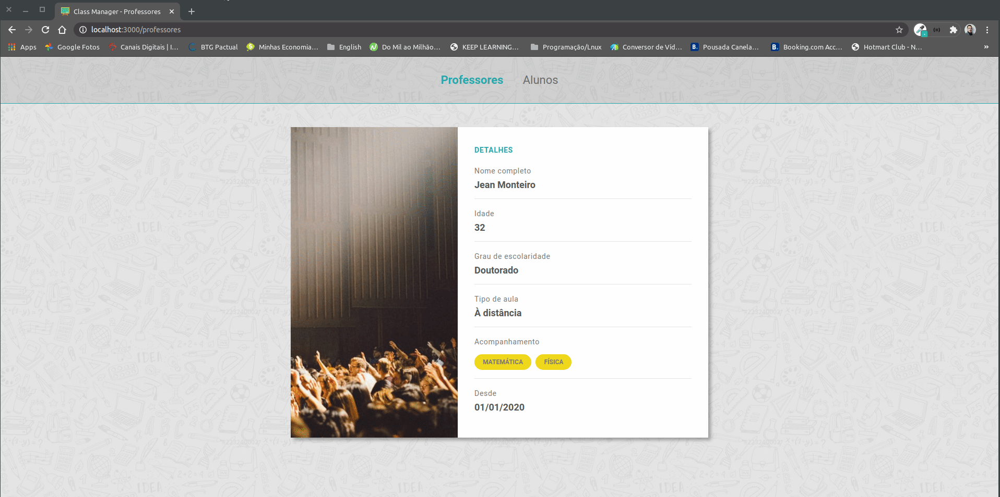

<h1 align="center">
    
</h1>

<h3 align="center">
  Desafio 4-4: Apresentação, edição e formatação dos dados de um professor
</h3>

<blockquote align="center">“Comece fazendo o que é necessário, depois o que é possível, e de repente você estará fazendo o impossível.”</blockquote>

  

  

  <a href="#rocket-sobre-o-desafio">Sobre o desafio</a>&nbsp;&nbsp;&nbsp;|&nbsp;&nbsp;&nbsp;
  <a href="#calendar-entrega">Entrega</a>&nbsp;&nbsp;&nbsp;|&nbsp;&nbsp;&nbsp;
  <a href="#memo-licença">Licença</a>

## 👨‍💻 Resultado do desafio

## :rocket: Sobre o desafio

Nessa etapa você deve criar duas rotas: uma para apresentar os dados do professor (show) e outra para a edição dos dados cadastrados (edit). Além disso, realize a formatação dos dados cadastrados para a correta exibição no HTML

### Show

Crie uma rota para lidar com a apresentação dos dados cadastrados de um professor. Dentro do arquivo `teachers.js`, crie um método `show` para buscar e retornar o professor a partir do `id` fornecido na rota. Os seguintes dados precisam ser formatados:

- Idade: Crie um arquivo `utils.js` que exporta uma função chamada `age`. Essa função deve retornar a idade a partir do parâmetro (data de nascimento) informado;
- Grau de escolaridade: crie uma função `graduation` no arquivo `utils.js`. Essa função deve retornar o grau de escolaridade formatado a partir do valor do select informado (ex.: **Ensino Médio Completo** para o valor **medio** do `select`);
- Acompanhamento: Utilize o método `split` da string para gerar um array com as matérias que o professor leciona;
- Desde: Utilize o constructor `Intl` e seus métodos para gerar uma data no formato `dia/mes/ano`.

Ao fim da apresentação dos dados, crie um link que irá redirecionar para a rota de edição dos dados cadastrados.

### Edição

Crie uma rota para lidar com a edição dos dados cadastrados de um professor. Dentro do arquivo `teachers.js`, crie um método `edit` para buscar e retornar o professor a partir do `id` fornecido na rota. Utilize a mesma interface da rota de apresentação dos dados do professor (lembrando de fazer o reaproveitamento do form com um arquivo `fields.njk`). Por fim, crie uma função chamada `date` no arquivo `utils.js`. Essa função deve retornar a data no formato `yyyy-mm-dd` para a correta exibição no input do tipo `date` no HTML (lembre de tratar os dias e meses menores que 10 utilizando o método `splice` da string).

### Estilização

Você tem liberdade para escolher a estilização que preferir para esse desafio.

## :calendar: Entrega

Esse desafio **não precisa ser entregue** e não receberá correção. Após concluí-lo, adicionar esse código ao seu Github é uma boa forma de demonstrar seus conhecimentos para oportunidades futuras.

## :memo: Licença

Esse projeto está sob a licença MIT. Veja o arquivo [LICENSE](../LICENSE) para mais detalhes.

---

Feito com :purple_heart: by [Rocketseat](https://rocketseat.com.br) :wave: [Entre na nossa comunidade!](https://discordapp.com/invite/gCRAFhc)