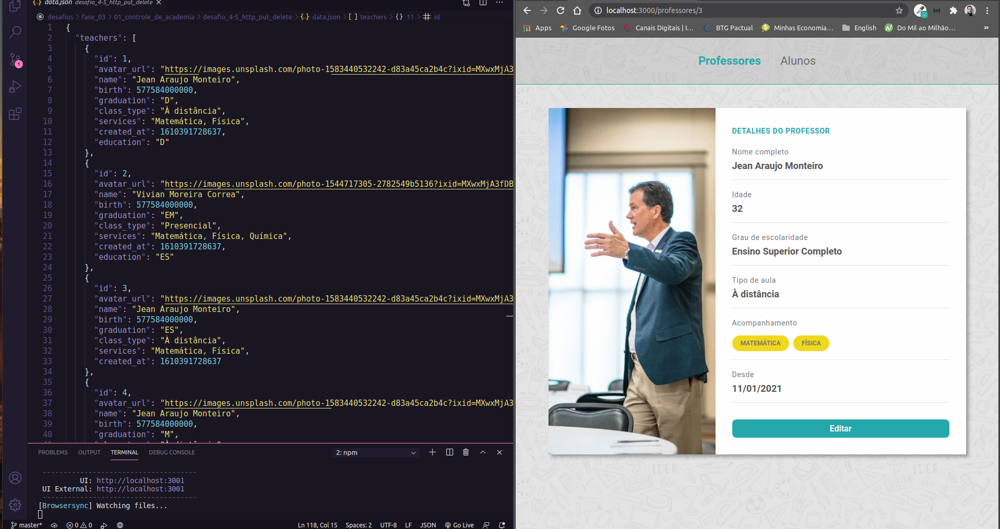

<h1 align="center">
    
</h1>

<h3 align="center">
  Desafio 4-5: HTTP: PUT e DELETE
</h3>

<blockquote align="center">“A impaciência é um grande obstáculo para o bom êxito.”</blockquote>

<p align="center">

  <a href="https://github.com/jeanmontt">
    
  </a>

  <a href="https://github.com/jeanmontt/launchbase/commits/master" >
    
  </a>

</p>

<p align="center">
  <a href="#rocket-sobre-o-desafio">Sobre o desafio</a>&nbsp;&nbsp;&nbsp;|&nbsp;&nbsp;&nbsp;
  <a href="#calendar-entrega">Entrega</a>&nbsp;&nbsp;&nbsp;|&nbsp;&nbsp;&nbsp;
  <a href="#memo-licença">Licença</a>
</p>

## 👨‍💻 Resultado do desafio



## :rocket: Sobre o desafio

Nessa etapa você irá implementar duas rotas: PUT e DELETE para a atualização e remoção, respectivamente, dos dados cadastrados de um professor.

### PUT

Crie uma rota para receber os dados do formulário de edição e propagar no arquivo `json`. Lembre de sobrescrever o método POST do form para PUT (utilize a lib `method-override`). Dentro do arquivo `teachers.js`, crie um método `update` para buscar e retornar o professor a partir do `id` fornecido na rota. Faça a busca pelo professor a partir do `id` e atualize no arquivo `json` os dados que foram alterados (utilize o constructor `Number` para formatar o id como número). Por fim, redirecione para a página de apresentação dos dados de um professor (show).

### DELETE

Crie um botão na página de apresentação dos dados do professor. Esse botão irá chamar uma rota para deletar o professor do arquivo `json`. Lembre de sobrescrever o método POST do form para DELETE (utilize a lib `method-override`). Dentro do arquivo `teachers.js`, crie um método `delete` e gere um array com todos os professores, exceto o que deve ser removido (`filter`). Por fim, redirecione para a página de listagem dos professores.

### Estilização

Você tem liberdade para escolher a estilização que preferir para esse desafio. Porém algumas coisas são obrigatórias:

- O botão de deletar deve ficar ao lado do botão de editar;
- O botão de deletar deve ser da cor vermelha.

## 💾️ Como baixar/testar o projeto

- Você irá precisar instalar o [Git](https://git-scm.com/), [NodeJS](https://nodejs.org/pt-br/download/) + [npm](https://www.npmjs.com/get-npm):

```bash
# Versões mínimas ou superiores.
$ node -v
v12.18.3

$ npm -v
6.14.6
```

- Para configurar, no bash digite os seguinte códigos:

```bash
# Clonar o repositório
$ git clone https://github.com/jeanmontt/launchbase.git

#Entrar no diretório
$ cd launchbase/fase_03/01_controle_de_academia/desafio_4-5_http_put_delete

#Instalar as dependências
$ npm install

#Iniciar o local host
$ npm start
```

- Por ultimo abra seu navegador e digite:

```
localhost:3000
```

## :memo: Licença

Esse projeto está sob a licença MIT. Veja o arquivo [LICENSE](../LICENSE) para mais detalhes.

---

#### Desenvolvido com 💙️ por:

***Jean Monteiro*** 
<br/> 
<a href="https://www.linkedin.com/in/jeanmont/">

</a>