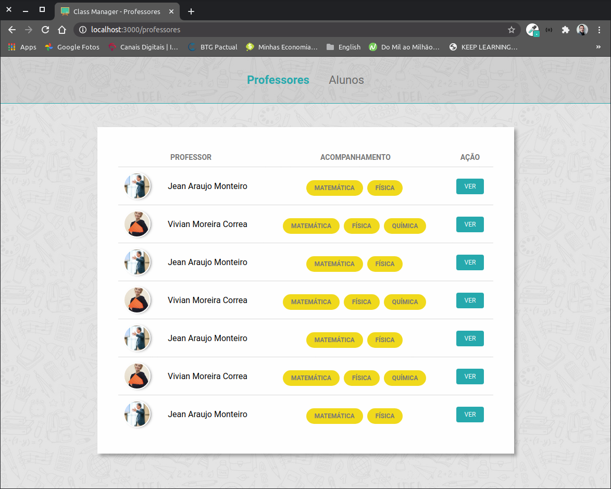

<h1 align="center">
    
</h1>

<h3 align="center">
  Desafio 4-6: Listagem de professores
</h3>

<blockquote align="center">“A persistência é o caminho do êxito.”</blockquote>

<p align="center">

  <a href="https://github.com/jeanmontt">
    
  </a>

  <a href="https://github.com/jeanmontt/launchbase/commits/master" >
    
  </a>

</p>

<p align="center">
  <a href="#rocket-sobre-o-desafio">Sobre o desafio</a>&nbsp;&nbsp;&nbsp;|&nbsp;&nbsp;&nbsp;
  <a href="#calendar-entrega">Entrega</a>&nbsp;&nbsp;&nbsp;|&nbsp;&nbsp;&nbsp;
  <a href="#memo-licença">Licença</a>
</p>

## 👨‍💻 Resultado do desafio



## :rocket: Sobre o desafio

Nessa etapa você deve listar todos os professores salvos no arquivo `json` e apresentá-los em formato de tabela.

### Listagem

Crie uma rota para repassar para o arquivo de listagem os dados dos professores salvos no arquivo `json`.

### Tabela

Crie um arquivo que irá mostrar os dados dos professores em formato de tabela. Utilize `Nome completo`, `Acompanhamento` e `Ação` como cabeçalhos.

### Estilização

Você tem liberdade para escolher a estilização que preferir para esse desafio, mas alguns pontos são obrigatórios:

- A tabela deve ocupar todo o espaçamento do cartão;
- Os cabeçalhos e os valores devem estar centralizados;
- A imagem deve ser apresentada antes do nome. Deve ter formato circular e tamanho de 40px;
- O campo `Acompanhamento` deve apresentar as matérias lecionadas de forma separada (array, assim como na página de apresentação de dados de um professor).

## 💾️ Como baixar/testar o projeto

- Você irá precisar instalar o [Git](https://git-scm.com/), [NodeJS](https://nodejs.org/pt-br/download/) + [npm](https://www.npmjs.com/get-npm):

```bash
# Versões mínimas ou superiores.
$ node -v
v12.18.3

$ npm -v
6.14.6
```

- Para configurar, no bash digite os seguinte códigos:

```bash
# Clonar o repositório
$ git clone https://github.com/jeanmontt/launchbase.git

#Entrar no diretório
$ cd launchbase/fase_03/01_controle_de_academia/desafio_4-6_listagem_de_professores

#Instalar as dependências
$ npm install

#Iniciar o local host
$ npm start
```

- Por ultimo abra seu navegador e digite:

```
localhost:3000
```

## :memo: Licença

Esse projeto está sob a licença MIT. Veja o arquivo [LICENSE](../LICENSE) para mais detalhes.

---

#### Desenvolvido com 💙️ por:

***Jean Monteiro*** 
<br/> 
<a href="https://www.linkedin.com/in/jeanmont/">

</a>