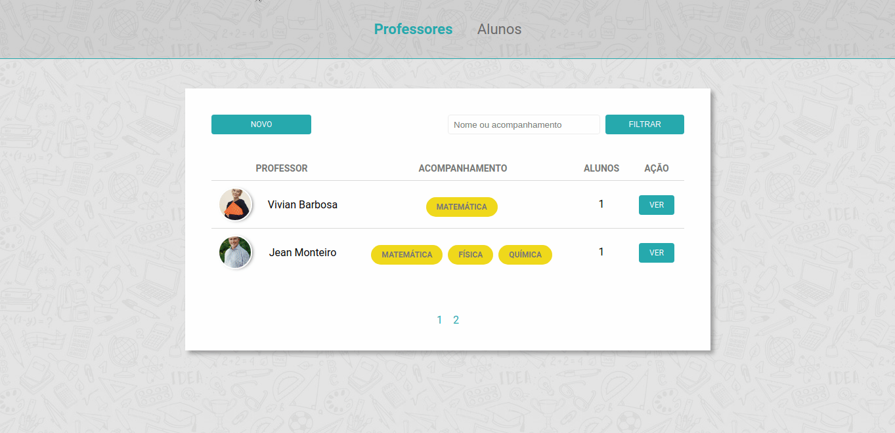

<h1 align="center">
    
</h1>

<h3 align="center">
  Desafio 5-4: Paginação de resultados no BD
</h3>

<blockquote align="center">“Não compare o seu bastidor com o palco do outro!”</blockquote>

<p align="center">

  <a href="https://github.com/jeanmontt">
    
  </a>

  <a href="https://github.com/jeanmontt/launchbase/commits/master" >
    
  </a>

</p>

<p align="center">
  <a href="#rocket-sobre-o-desafio">Sobre o desafio</a>&nbsp;&nbsp;&nbsp;|&nbsp;&nbsp;&nbsp;
  <a href="#calendar-entrega">Entrega</a>&nbsp;&nbsp;&nbsp;|&nbsp;&nbsp;&nbsp;
  <a href="#memo-licença">Licença</a>
</p>

## 👨‍💻 Resultado do desafio



## :rocket: Sobre o desafio

Nessa etapa, você deve implementar a lógica de paginação dos resultados do BD.

### Backend

Adicione no método `index` do controller de professores o tratamento dos campos `page` e `limit` que serão transmitidos via `query params`. Além disso, faça o cálculo do `offset` a ser passado para a query. Por fim, crie um novo método `paginate` no model que deve implementar toda a query já existente (com filter e order) e também adicionar a paginação (utilize `LIMIT` e `OFFSET`).

### Frontend

Crie um algoritmo que realize a paginação dos resultados da seguinte forma:

- As duas primeiras e últimas páginas sempre devem ser apresentadas (ex: 1, 2, 45 e 46 de um total de 46 pags.);
- Caso existam mais de 7 páginas, as intermediárias selecionadas devem ser apresentadas juntamente com seu sucessor e antecessor (ex.: 1, 2, ..., 12, 13 (selecionada), 14, ..., 23, 24);
- Só apresente as reticências se elas representarem um grupo de 2 páginas ou mais (ex.: 1, 2, 3 (sem reticências), 4, 5 (selecionada), 6, ...(pags 7 e 8), 9, 10).

Em seguida, implemente na query do método `paginate` no model de professor a lógica da paginação:

- realizar o `count` de todos os registros de professores (utilize uma `subquery`);
- aplicar os filtros tanto na `query` de busca dos professores quanto na `subquery` de `count`.

Por fim, utilize o `scripts.js` para renderizar no `html` (não faça no `nunjucks`) a paginação ao final da listagem (não esqueça que as reticências não devem ser links).

### Ajustes finais

Para finalizar, basta:

- Estilizar a paginação;
- Preservar o filter quando a página for alterada;
- Implementar no front dos estudantes a paginação (siga a mesma ideia aplicada nos professores).

### Estilização

Você tem liberdade para escolher a estilização que preferir para esse desafio.

## 💾️ Como baixar/testar o projeto

- Você irá precisar instalar o [Git](https://git-scm.com/), [NodeJS](https://nodejs.org/pt-br/download/) + [npm](https://www.npmjs.com/get-npm):

```bash
# Versões mínimas ou superiores.
$ node -v
v12.18.3

$ npm -v
6.14.6
```

- Para configurar, no bash digite os seguinte códigos:

```bash
# Clonar o repositório
$ git clone https://github.com/jeanmontt/launchbase.git

#Entrar no diretório
$ cd launchbase/fase_03/01_controle_de_academia/desafio_5-4_paginacao_de_resultados_bd

#Instalar as dependências
$ npm install

#Iniciar o local host
$ npm start
```

- Por ultimo abra seu navegador e digite:

```
localhost:3000
```

## :memo: Licença

Esse projeto está sob a licença MIT. Veja o arquivo [LICENSE](../LICENSE) para mais detalhes.

---

#### Desenvolvido com 💙️ por:

***Jean Monteiro*** 
<br/> 
<a href="https://www.linkedin.com/in/jeanmont/">

</a>